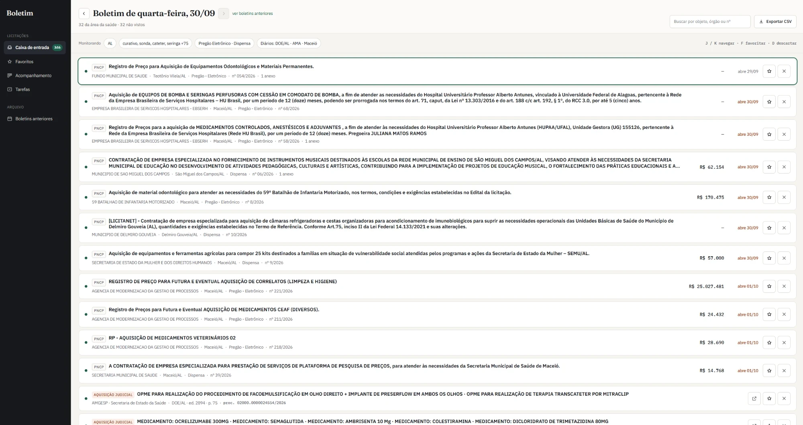
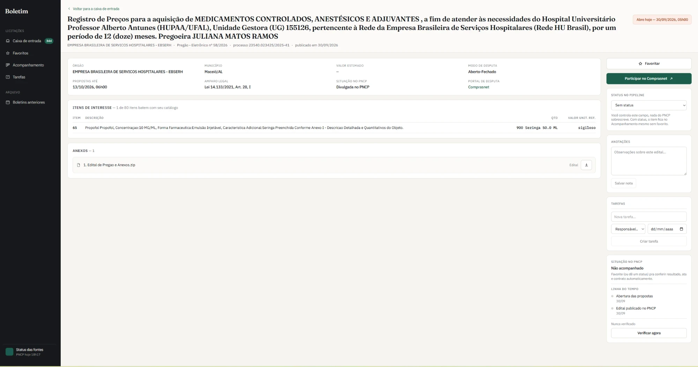

# Monitor de Licitações — Saúde

Sistema de monitoramento de licitações públicas da área da saúde em Alagoas. Foi construído para uso interno de uma distribuidora de material médico-hospitalar, para substituir uma assinatura paga de alertas de licitação.

Todo dia o sistema varre as fontes oficiais de compras públicas, filtra o que interessa ao catálogo da empresa e entrega um **boletim diário** para triagem. Os editais escolhidos passam para um fluxo de acompanhamento com tarefas, anotações e detecção automática de resultado.

> **Status:** em uso interno, fase de validação (MVP). Este repositório é um retrato do código publicado como portfólio; o desenvolvimento acontece num repositório privado, junto com os dados, as credenciais e a instância de produção.


<sub>Boletim do dia: editais do PNCP e avisos dos diários oficiais numa lista só, ordenada por prazo, com triagem por teclado (J/K navegar, F favoritar, D descartar).</sub>


<sub>Detalhe do edital: só os itens que batem com o catálogo (1 de 80, no exemplo), anexos, status interno, anotações, tarefas e linha do tempo.</sub>

---

## O problema

Uma empresa que vende para o governo precisa saber, todo dia, quais órgãos abriram compras dos produtos dela. Hoje isso passa por serviços pagos que agregam editais. A empresa usava um desses serviços, e as queixas de quem usava no dia a dia eram:

- **Feito para qualquer ramo, não para a área médica.** A plataforma atende de construtora a gráfica. Para o setor de saúde isso significa filtrar à mão boletins cheios de coisa que não interessa, e ainda assim perder oportunidades específicas do ramo, como as aquisições judiciais de OPME e medicamentos.
- **Opção demais.** A tela é cheia de módulos, menus, filtros e configurações, e a maioria não servia para nada no trabalho dele. O dono da empresa reclamava bastante da quantidade de coisa na plataforma: a sensação ao abrir era de ficar sobrecarregado antes mesmo de começar. O que ele queria era algo enxuto, fácil de usar e focado no ramo dele: abrir, ver o que chegou de novo e decidir em segundos.
- **Caro para o que entrega.** Paga-se pelo pacote inteiro e usa-se só uma fração dele.

Por isso o princípio do projeto é **fazer pouco e fazer certo**: só as funções que o usuário realmente usa, com o filtro afinado para o catálogo de uma distribuidora de material médico-hospitalar. Uma função chegou a ser descartada no planejamento (leitura de edital por IA) porque o serviço pago tinha e ninguém usava.

As informações são públicas, mas estão espalhadas:

- o **PNCP** (Portal Nacional de Contratações Públicas) tem API aberta, mas fica fora do ar com frequência e não traz tudo;
- **aquisições judiciais** (compras emergenciais que o Estado faz por ordem judicial, como OPME e medicamentos) e **cotações** saem só no **Diário Oficial do Estado**;
- prefeituras publicam avisos e cotações nos **diários oficiais municipais**, às vezes antes do PNCP.

O projeto junta essas fontes num só lugar, com um filtro afinado para o catálogo real da empresa.

## O que ele faz

- **Captura automática, várias vezes por dia**, de quatro fontes:
  - PNCP: Pregão Eletrônico e Dispensa em AL;
  - Diário Oficial do Estado de Alagoas: aquisições judiciais, pregões estaduais e avisos de cotação;
  - diários municipais (AMA, Maceió e Maceió Saúde): avisos de licitação, dispensa e cotação.
- **Filtro por palavra-chave** com um motor de casamento de texto próprio (detalhes abaixo), organizado por segmento (materiais médico-hospitalares, equipamentos, gases medicinais, radiologia, dieta enteral, medicamentos, higiene) e cobrindo também laboratório e odontologia.
- **Checagem em segundo plano dos itens de cada compra.** Quando o objeto geral não bate nenhuma palavra-chave, os itens da compra vão para uma fila e são verificados um a um (ex.: "aquisição de equipamentos diversos" que tem um ultrassom no item 14).
- **Boletim do dia:** uma lista única ordenada por urgência, com triagem por teclado (visto / favoritar / descartar / desfazer).
- **Tela do edital:** itens, anexos (com cópia local da lista e download de todos em `.zip` via streaming) e link para o portal da disputa.
- **Acompanhamento:** um painel por status interno (gerenciada / em andamento / finalizada / ganha), com responsáveis, tarefas com prazo e anotações.
- **Linha do tempo automática** dos editais acompanhados: o sistema consulta o PNCP periodicamente e registra homologação, ata de registro de preços e contrato assinado. Quando o vencedor tem o CNPJ da empresa, ele **sugere marcar como "ganha"** (nunca marca sozinho).
- **Arquivo** de boletins anteriores, com busca em todo o histórico.
- **Status das fontes:** uma tela que mostra a saúde de cada captura (último sucesso, falhas seguidas, erro explicado em português) e acende um aviso global quando alguma fonte para de rodar.
- **Exportação CSV** compatível com o Excel em português (`;` + BOM).

## Arquitetura

```
 GitHub Actions (cron)                     Vercel (Next.js)                         Neon (Postgres)
┌──────────────────────┐   Bearer    ┌──────────────────────────────┐          ┌─────────────────────┐
│ sync-cron        3x/d│────────────▶│ /api/sync          ─ PNCP    │─────────▶│ editais             │
│ sync-doe         3x/d│────────────▶│ /api/sync-doe      ─ DOE-AL  │─────────▶│ doe_al_*            │
│ sync-diarios     3x/d│────────────▶│ /api/sync-diarios-municipais │─────────▶│ diario_municipal_*  │
│ verificar-itens 30min│────────────▶│ /api/verificar-itens         │─────────▶│ itens_pendentes     │
│                      │             │ /api/atualizar-detalhes      │          │ edital_status       │
│                      │             │ /api/acompanhar              │─────────▶│ edital_eventos      │
└──────────────────────┘             │                              │          │ tarefas, anotacoes  │
                                     │ App Router + Server Actions  │◀────────▶│ sync_runs           │
                                     │ (boletim, edital, tarefas…)  │          └─────────────────────┘
                                     └──────────────────────────────┘
```

**Stack:** Next.js 16 (App Router, Server Components, Server Actions) · React 19 · TypeScript · Tailwind CSS v4 · PostgreSQL serverless (Neon, driver `@neondatabase/serverless`) · Vercel · GitHub Actions como agendador · `pdf-parse` para ler os diários oficiais.

### Decisões técnicas que valem destacar

**Fontes instáveis são a regra, não a exceção.** O PNCP tem quedas reais e recorrentes, às vezes de mais de uma hora. Por isso:
- toda chamada externa tem timeout (`AbortSignal.timeout`), retry com backoff e um orçamento de tempo, para a função serverless nunca estourar o `maxDuration` sem registrar o que aconteceu;
- cada rodada reconsulta uma janela de vários dias (7 no PNCP, 14 no DOE-AL). A inserção é idempotente (`ON CONFLICT DO NOTHING` sobre chaves canônicas), então reconsultar não custa nada e uma queda de um dia não perde edital;
- toda execução vai para `sync_runs`, e é daí que sai a tela de status das fontes.

**Engenharia reversa de APIs não documentadas.** O Diário Oficial do Estado é uma SPA sem API documentada. Os endpoints foram mapeados a partir do bundle JS do próprio site. Quando a busca full-text deles travou num índice de meses atrás (sem erro, só respondendo com dado velho), foi implementado um caminho alternativo: listar as edições publicadas, baixar o PDF de cada uma e extrair os avisos localmente por regex sobre o formato fixo do registro. Também foi preciso lidar com edições republicadas com ID novo e com suplementos que têm o mesmo número da edição normal.

**Motor de palavras-chave feito sob medida** (`lib/keywords.ts`), refinado caso a caso comparando a captura com o boletim do serviço pago:
- normalização de acento e hífen, casamento por borda de palavra (para "maca" não bater em "informação");
- plural em cada palavra de termos compostos, incluindo os irregulares (`-al → -ais`, `colchão → colchões`, `álcool → álcoois`);
- tolerância a espaço dentro da palavra ("Ultra som" = "ultrassom"), com tratamento da dobra do "s" intervocálico;
- **termos compostos por presença**, sem exigir palavras adjacentes (`gás + medicinal` pega "Gás comprimido, nome: oxigênio… característica adicional: medicinal");
- toda mudança é validada com uma regressão contra todos os objetos já capturados no banco (versão antiga × nova, diferença zero ou só ganhos legítimos).

**Zip em streaming sem dependência** (`lib/zip.ts`). A resposta comum da Vercel tem teto de 4,5 MB, então o "baixar todos os anexos" monta um zip (modo *store*, CRC32 próprio) direto no stream: 4 downloads em paralelo, escritos na ordem. Testado com 40 anexos / 38 MB.

**Dados do fato × dados da captura.** A linha do tempo do acompanhamento é só de acréscimo, com chave única por fato, e guarda separadamente quando o fato aconteceu e quando foi percebido.

## Estrutura

```
app/
  page.tsx, boletim/[dia]/     boletim do dia (+ exportação CSV)
  edital/[numero]/             detalhe do edital, anexos (.zip)
  aviso/[fonte]/[id]/          aviso publicado só em diário oficial
  acompanhamento/, tarefas/    pipeline interno
  arquivo/, saude/             histórico e status das fontes
  actions/                     Server Actions (triagem, tarefas, notas)
  api/                         rotas chamadas pelo cron
lib/
  pncp.ts, detalhe-pncp.ts, acompanhamento-pncp.ts   cliente do PNCP
  doe.ts, diario-municipal.ts                         diários oficiais
  keywords.ts                                         motor de palavras-chave
  schema.sql                                          DDL completo
components/                    UI por tela
docs/
  design/                      especificação de interface + protótipos HTML
.github/workflows/             agendamentos
```

## Rodando localmente

Pré-requisitos: Node 20+ e um banco PostgreSQL (o [Neon](https://neon.tech) tem plano gratuito).

```bash
npm install

# .env.local
DATABASE_URL=postgres://...
CRON_SECRET=qualquer-segredo    # opcional; protege as rotas /api/*
NOME_EMPRESA=Minha Empresa      # opcional; aparece na interface
CNPJ_EMPRESA=00000000000000     # opcional; liga a sugestão automática de "ganha"

npm run migrate   # cria as tabelas a partir de lib/schema.sql
npm run dev
```

Para popular o banco, chame as rotas de captura:

```bash
curl -H "Authorization: Bearer $CRON_SECRET" http://localhost:3000/api/sync
curl -H "Authorization: Bearer $CRON_SECRET" http://localhost:3000/api/sync-doe
curl -H "Authorization: Bearer $CRON_SECRET" http://localhost:3000/api/sync-diarios-municipais
```

Em produção, quem chama essas rotas são os workflows de `.github/workflows/`, com `CRON_SECRET` e `APP_URL` (endereço do deploy) guardados nos secrets do repositório.

## Como foi validado

Antes de ter interface, o sistema rodou semanas em paralelo com o serviço pago. Cada boletim recebido foi comparado item a item com o que estava no banco, e cada item perdido tinha a causa investigada: palavra-chave faltando, bug no motor de casamento, modalidade fora do escopo ou fonte que não estava sendo lida. Foi assim que surgiram as fontes do Diário Oficial e boa parte das regras do motor de palavras-chave. Nos boletins mais recentes, a captura empata ou passa o serviço pago dentro do escopo definido. O log dessa comparação cita dados internos da empresa e ficou fora deste repositório.

## Próximos passos

- Alerta por e-mail de edital novo
- Versão para celular
- Cópia própria dos PDFs dos anexos (object storage), para não depender do PNCP estar no ar
- Agendador externo mais pontual que o cron do GitHub Actions

---

Desenvolvido por [@Eduardo-Brrs](https://github.com/Eduardo-Brrs).
